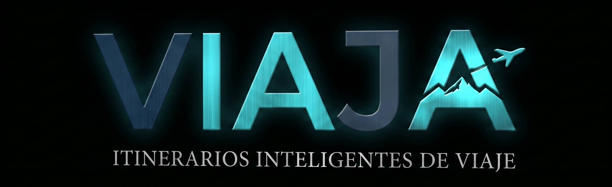

<div align="center">
  
</div>

# VIAJA ✈️

**ITINERARIOS INTELIGENTES DE VIAJE**

---

## 📌 Sobre el Proyecto

**VIAJA** es una aplicación web centralizada diseñada para revolucionar la planificación de viajes mediante el uso integrado de Inteligencia Artificial. El objetivo principal es eliminar la fragmentación y el exceso de tiempo invertido en organizar rutas turísticas.

A través de un buscador avanzado, el usuario parametriza sus necesidades (destino, presupuesto, número de noches, intereses, requisitos alimenticios,etc). El sistema orquesta esta información hacia la API de Google Gemini, generando itinerarios hiperpersonalizados y estructurados, complementados dinámicamente con fotografías en alta resolución.


---

## 🏗️ Arquitectura del Sistema (Stack Tecnológico)

Este proyecto utiliza los estándares modernos de la industria, garantizando modularidad, seguridad y reactividad.

- **Backend (PHP 8.3 & Laravel 11):** Actúa como el cerebro del sistema. Gestiona la lógica de negocio, la seguridad de las rutas compartidas y la comunicación con APIs externas.
- **Frontend (Vue.js 3 & Tailwind CSS):** Interfaz de usuario reactiva, fluida y adaptada a dispositivos móviles (Mobile First). Se apoya en librerías como Chart.js para la visualización de métricas analíticas en los paneles de administración.
- **El Puente (Inertia.js & Laravel Breeze):** Sustituye la necesidad de construir y mantener una API REST tradicional. Inertia permite que los controladores de Laravel rendericen componentes de Vue directamente, inyectando los datos de la base de datos como _props_ de forma segura y veloz.
- **Persistencia (MySQL 8.4):** Sistema de gestión de base de datos relacional para almacenar usuarios, roles, métricas y el histórico completo de los itinerarios generados.

---

## 🚀 Características Avanzadas

Para dotar a la aplicación de un nivel de ingeniería de software avanzado, se han implementado las siguientes soluciones:

- **Sistema Multirrol y CRUD:** Gestión completa de usuarios (Administrador/Usuario) con paneles de control (Dashboards) protegidos. Los usuarios pueden guardar, borrar y marcar viajes como favoritos, mientras que los administradores auditan el crecimiento de la plataforma.
- **Doble Capa de Caché (Redis):** Integración de Redis en memoria RAM para almacenar temporalmente los resultados de Gemini y Unsplash. Si un usuario busca un viaje idéntico a uno generado recientemente, el sistema sirve la respuesta en milisegundos desde la caché, ahorrando cuotas económicas de la API y tiempo de carga.
- **Procesos Asíncronos (Colas de Trabajo):** El envío de correos electrónicos (ej. verificación de cuenta) se desacopla del hilo principal mediante _Workers_ de Redis. Esto evita que la pantalla del usuario se congele mientras el servidor negocia con el SMTP de Gmail.
- **Exportación y Socialización:** Capacidad de exportar los itinerarios a formato PDF o generar enlaces públicos criptográficamente seguros para compartir rutas con terceros.

---

## ⚙️ Guía de Despliegue Local

Gracias a la reingeniería de la infraestructura hacia una arquitectura contenerizada con Docker y Laravel Sail, este proyecto elimina la dependencia de servidores locales acoplados (como XAMPP). Los servicios se ejecutan de forma nativa sobre un kernel Linux (vía WSL 2 en Windows), garantizando que el software funcione de manera idéntica en cualquier equipo.

### Requisitos Previos

- **Git** (Para control de versiones).
- **Docker Desktop** (Con WSL 2 activo si usas Windows).

### Instrucciones Paso a Paso

**1. Clonar el repositorio fuente**

```bash
git clone [https://github.com/aymardieguez/viaja-tfc.git](https://github.com/aymardieguez/viaja-tfc.git)
cd viaja-tfc
```

**2. Configurar el Archivo de Entorno Local (.env)**

Crea tu propia copia a partir de la plantilla y configura tus claves privadas:

```bash
cp .env.example .env
```

_(Añade tus API Keys de Gemini y Unsplash en este archivo)._

**3. Instalación de Dependencias (Contenedor Efímero)**

Para no depender de tener PHP instalado en tu máquina, inyectamos las dependencias de Laravel usando un contenedor de usar y tirar:

```bash
docker run --rm -u "$(id -u):$(id -g)" -v "$(pwd):/var/www/html" -w /var/www/html laravelsail/php83-composer:latest composer install
```

**4. Levantar la Infraestructura (Backend, Base de Datos, Caché)**

Inicia los contenedores orquestados por Sail en segundo plano:

```bash
./vendor/bin/sail up -d
```

**5. Criptografía y Estructura de Datos**

Genera la clave de seguridad de la app y levanta las tablas relacionales:

```bash
./vendor/bin/sail artisan key:generate
./vendor/bin/sail artisan migrate --seed
```

**6. Inicializar el Frontend**

Arranca el compilador Vite. Mantén esta terminal abierta que actualizará tus vistas de Vue en tiempo real al editar el código:

```bash
./vendor/bin/sail npm install
./vendor/bin/sail npm run dev
```

**7. Activar el Procesador Asíncrono (Workers)**

En una pestaña nueva, arranca el motor encargado de gestionar los correos y tareas pesadas en segundo plano:

```bash
./vendor/bin/sail artisan queue:work
```

---

## 🌐 Acceso a la Aplicación

Una vez que todos los contenedores estén levantados y los _workers_ activos, el proyecto estará funcionando al 100% de su capacidad. Puedes acceder a él desde tu navegador en:

**👉 [http://localhost](http://localhost)**

---

## 👨‍💻 Autor

Desarrollado por **Aymar Salgado Diéguez** como Trabajo de Fin de Ciclo (DAW).
